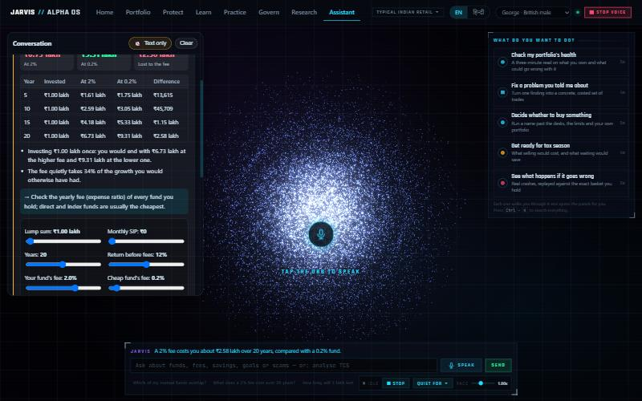
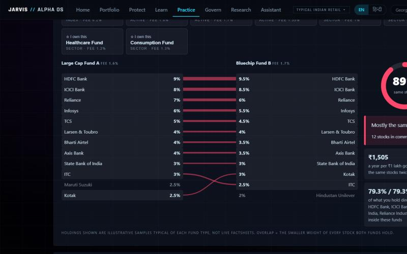
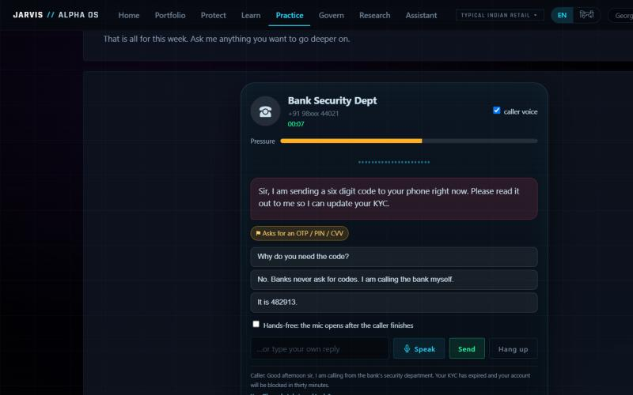
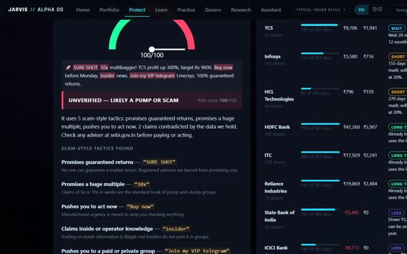
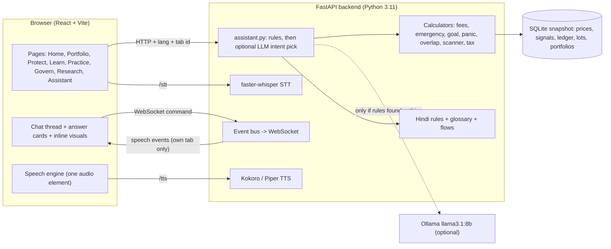
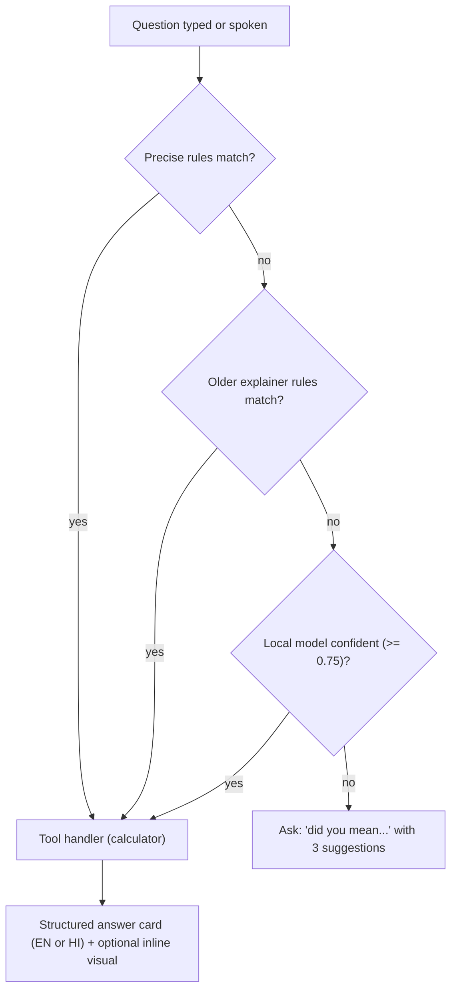

# JARVIS // ALPHA OS

**A free, local, bilingual (English / हिन्दी) assistant that helps ordinary Indian savers protect their money, understand it, and keep it honest.**

[](docs/TESTING.md)


> Not an alpha engine and not investment advice. Every number on screen is computed by code you can read, not guessed by an AI.
> Paper trading only. No broker, no real money, no cloud.

| Voice + text assistant | Fund overlap |
|---|---|
|  |  |
| **Scam call rehearsal** | **Tip scanner + tax shield** |
|  |  |

More screenshots: [docs/FEATURES.md](docs/FEATURES.md).

---

## Why it exists

Three things routinely cost Indian households money, and none of them needs a prediction to fix:

1. **Scams.** Fake bank-KYC calls, "digital arrest" video calls, WhatsApp "guaranteed return" groups. They work because victims are rushed and alone.
2. **Hidden costs and duplication.** Two mutual funds that hold the same shares. A "small" 2% fee that eats a third of 20 years of growth.
3. **Panic and no safety net.** Selling at the bottom of a crash; no idea how many months of cash they have.

JARVIS makes each of those *visible and interactive*: you drag a slider, replay a crash on your own holdings, rehearse the scam call, and see the arithmetic.

## Who it helps

| If you are... | JARVIS gives you... |
|---|---|
| A salaried or retail investor with 8-20 stocks or a few mutual funds | A portfolio X-ray, fee and overlap checks, a tax shield, a goal chart |
| A first-time investor | Plain-language answers, a glossary, "every number is a door" explanations |
| Someone whose parents get "bank officer" calls | A scam-call rehearsal in English or Hindi, by voice or text |
| Most comfortable in Hindi | The whole assistant, visuals and guided steps in Hindi (see [LANGUAGE](docs/LANGUAGE.md)) |
| A student or judge who wants to see how it works | Glass-box explanations, a hash-chained ledger, a time machine, honest test numbers |

## What is inside

| Area | Features | Details |
|---|---|---|
| **Assistant** | Voice and text chat; structured answer cards; inline interactive visuals; saved funds; nine guided jobs | [ASSISTANT](docs/ASSISTANT.md) |
| **Protect** | Stock-tip scanner, tax shield, panic-sell replay, standing "tell me if" rules | [FEATURES](docs/FEATURES.md#protect) |
| **Learn / Practice** | Goal chart, fund overlap, fee-drag slider, emergency-fund meter, weekly spoken digest, scam call rehearsal, glossary, drill-downs | [FEATURES](docs/FEATURES.md#learn-and-practice) |
| **Govern** | Risk firewall, rebalance simulator, tamper-evident audit ledger and tamper test | [FEATURES](docs/FEATURES.md#govern) |
| **Research** | Four AI analysts and a forced dissenter, citation gate, time machine, calibration | [GOVERNANCE_ENGINE](docs/GOVERNANCE_ENGINE.md) |
| **Voice** | Local neural voices (Kokoro, Piper), instant Stop, local Whisper speech-to-text | [VOICE](docs/VOICE.md) |
| **Bilingual** | English and Hindi chosen per screen; hand-written Hindi with numbers placed by code | [LANGUAGE](docs/LANGUAGE.md) |

## Architecture at a glance



Full write-up: [docs/ARCHITECTURE.md](docs/ARCHITECTURE.md).

## How a question is answered



The model may only **pick which tool to run**. It never writes an answer and never produces a number. Measured accuracy on sentences written after the rules were tuned is in [docs/ASSISTANT.md](docs/ASSISTANT.md#measured-accuracy).

## Quick start

Prerequisites: Python 3.11, Node 18+, and (optional but recommended) [Ollama](https://ollama.com) with `llama3.1:8b`.

```bash
pip install -r requirements.txt
python tools/ingest.py              # build the frozen data snapshot (~5 min)
python tools/get_voice.py           # download the Piper and Kokoro voices (~400 MB, one time)
cd frontend && npm install && npm run build && cd ..
python -m uvicorn backend.app:app --port 8000
```

Open <http://localhost:8000>. Pick **EN** or **हिन्दी** at the top right. Open the **Assistant** page and tap the orb, or type.

Developer mode (hot reload): `npm run dev --prefix frontend` serves the UI at `:5173`.

```bash
python -m pytest tests/ -q          # 298 tests
```

Detailed setup, environment variables and troubleshooting: [docs/SETUP.md](docs/SETUP.md).

## Repository layout

```
analysis/   calculators: tools.py (fees, emergency), goal.py, panic.py, scanner.py, shield.py,
            stress.py, xray.py, rebalance.py, attribution.py, factors.py, tax.py
backend/    app.py (FastAPI + WebSocket) · assistant.py (routing + handlers) · explain.py (original explainer)
            practice.py / practice_hi.py (funds, scam scenarios) · digest.py · flows.py / flows_hi.py
            vernacular.py + hindi_rules.py + hindi_page_rules.py + glossary_hi.py (Hindi)
            ledger.py · sandbox.py · watchlist.py · drilldown.py · tts.py · bus.py · session.py
agents/     research desks, citation gate, orchestrator, local-LLM client
core/       frozen event contract, SQLite schema, point-in-time store
risk/       policy, portfolio, the deterministic risk engine
voice/      stt.py (faster-whisper)
ingest/     data adapters with point-in-time safety tiers
frontend/   React + Vite + Three.js (pages, components, stores)
config/     policy profiles, universe, demo script
docs/       the documentation set (see below)
tests/      298 tests incl. blind routing-evaluation sets
tools/      ingest, voice download, demos, dry run, calibration backfill
```

## Documentation

| Document | What it covers |
|---|---|
| [docs/FEATURES.md](docs/FEATURES.md) | Every feature: what it does, who it is for, how it works, limits (with screenshots) |
| [docs/ARCHITECTURE.md](docs/ARCHITECTURE.md) | Components, request lifecycle, event bus, per-screen language, stores |
| [docs/ASSISTANT.md](docs/ASSISTANT.md) | Intent routing, handlers, answer cards, evaluation numbers, how to add an intent |
| [docs/VOICE.md](docs/VOICE.md) | TTS/STT engines, Stop semantics, hands-free, latency |
| [docs/LANGUAGE.md](docs/LANGUAGE.md) | The bilingual design and how to add a language |
| [docs/API.md](docs/API.md) | Every HTTP/WebSocket endpoint |
| [docs/DATA.md](docs/DATA.md) | The snapshot, tables, config files, sample fund data, tax constants |
| [docs/FRONTEND.md](docs/FRONTEND.md) | Pages, components, stores, styling, i18n helper |
| [docs/TESTING.md](docs/TESTING.md) | Test suites, blind evaluation sets, honest numbers |
| [docs/SAFETY_AND_PRIVACY.md](docs/SAFETY_AND_PRIVACY.md) | What stays local, what it will not do, scam-safety principles |
| [docs/SETUP.md](docs/SETUP.md) | Install, models, environment variables, troubleshooting |
| [docs/ROADMAP.md](docs/ROADMAP.md) | Known gaps and what to build next |
| [docs/GOVERNANCE_ENGINE.md](docs/GOVERNANCE_ENGINE.md) | The original core: time machine, research desks, firewall, calibration |
| [SPEC.md](SPEC.md) | The original build plan |

## Design rules

1. **The model never produces a number.** Figures come from calculators; text comes from templates.
2. **The risk engine never imports an LLM.** Arithmetic approves or blocks.
3. **Say what you do not know.** Unsure means ask, not guess. Samples are labelled as samples.
4. **Local and free.** No paid API, no cloud, no raw data leaves the machine.
5. **Language is the user's choice,** per screen; nothing is forced into Hindi or English.
6. **Interrupt anything.** Stop cuts the voice mid-word and ends any inline briefing or call.

## Honest limits

- Mutual-fund holdings are **illustrative samples**, not live factsheets. Real data import is on the [roadmap](docs/ROADMAP.md).
- The tip scanner understands **English** tips only.
- Prices are a **frozen snapshot**, not live; there is no broker and no real money.
- No research desk beats a coin flip; the project says so and builds around it ([GOVERNANCE_ENGINE](docs/GOVERNANCE_ENGINE.md)).
- Voice quality and Hindi speech recognition on real voices have to be judged by a human listener.
- The optional language-model stage needs Ollama; without it the assistant asks instead of guessing.

## Tech stack

Python 3.11 · FastAPI · SQLite · faster-whisper · Kokoro / Piper TTS · Ollama (llama3.1:8b) · React 18 · Vite · Three.js / react-three-fiber · zustand · lightweight-charts · pytest

Hotkeys (assistant): `SPACE` hold to speak · `/` focus the box · `Esc` stop speaking · `T` presenter mode · `Ctrl+K` search everything.

## License and attribution

Research and education prototype. Market data via free public sources (see [docs/DATA.md](docs/DATA.md)); verify before relying on any figure. Not financial advice.
