# JARVIS // money, plainly

**A free, local, bilingual (English and हिन्दी) money guard for Indian households.** It checks a decision before money moves: a scam call, a tip, a moneylender's quote, a fund's fee, a loan offer. Every number is computed by code you can read. No model writes a figure.

[](docs/TESTING.md)


> **Prototype, not a product.** Paper trading only. No broker, no real money, no real payments. Not investment advice. Figures in the business documents are assumptions until a pilot measures them.

---

## Contents

[The problem](#the-problem) · [The prototype](#the-prototype) · [How a question is answered](#how-a-question-is-answered) · [Architecture](#architecture) · [Business](#business) · [Quick start](#quick-start) · [Data](#data) · [Documentation](#documentation) · [Honest limits](#honest-limits) · [Tech stack](#tech-stack)

---

## See it

| Landing | Set up for your audience |
|---|---|
| 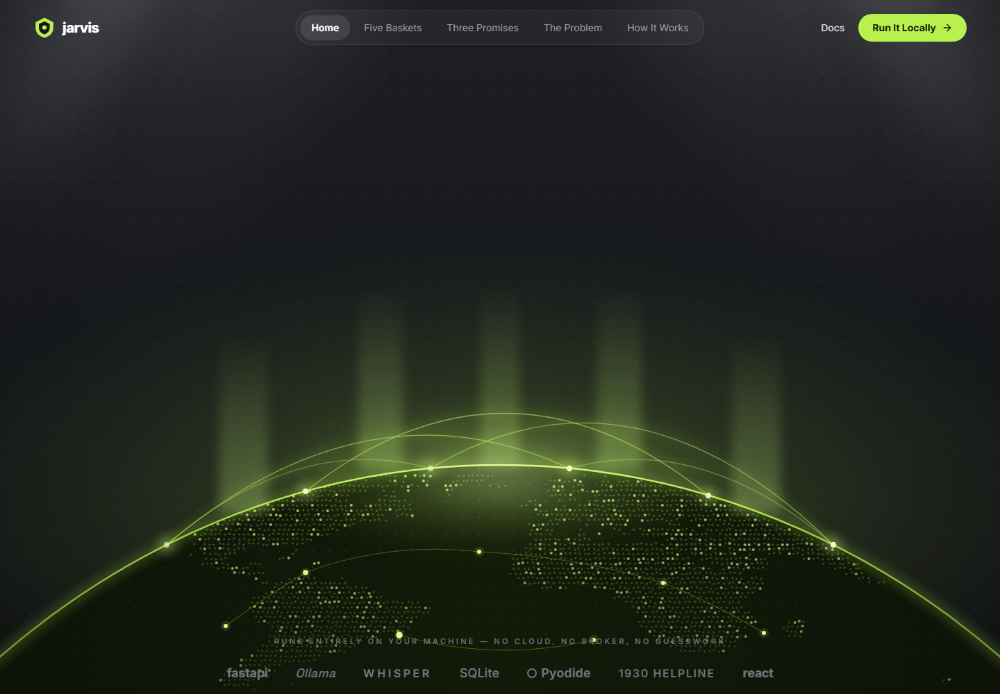 | 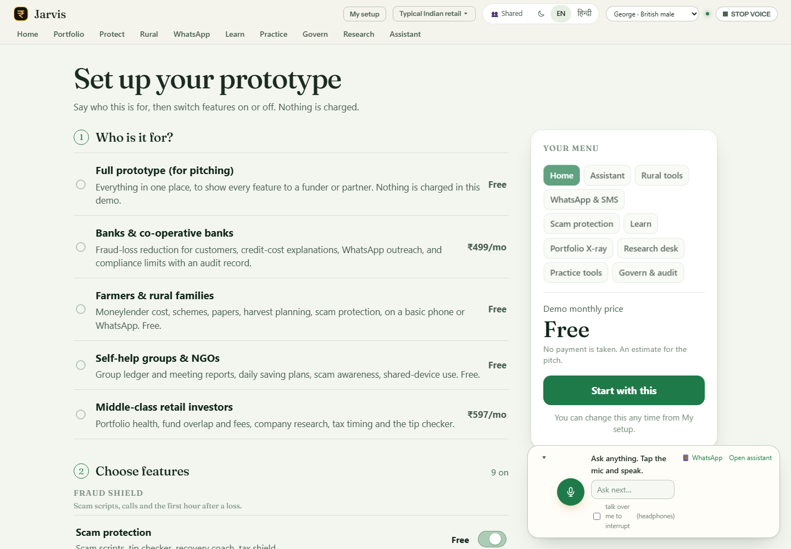 |
| **Home, grouped by loss** | **Scam protection and recovery coach** |
| 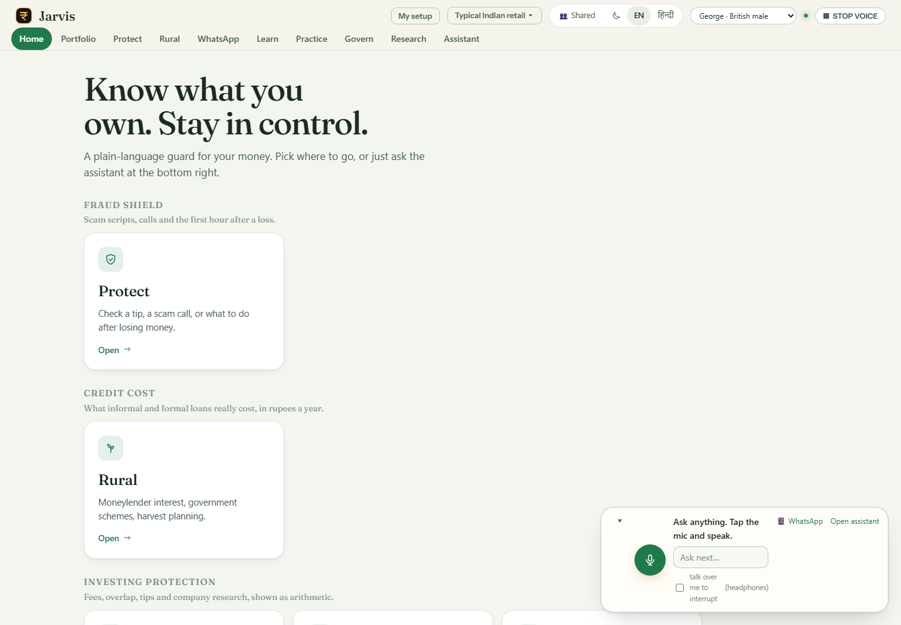 | 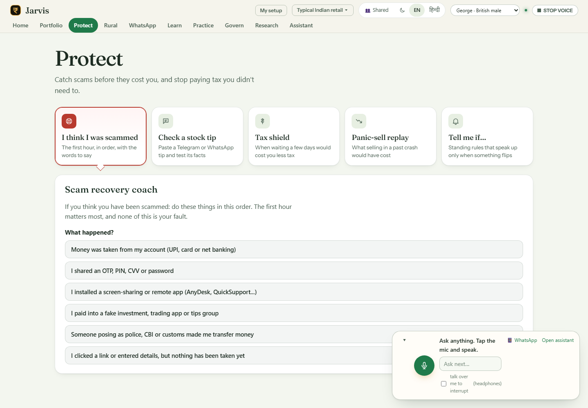 |
| **Scam-call rehearsal** | **"Is this offer real?"** |
| 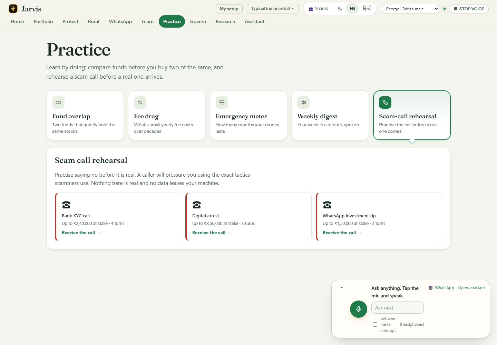 | 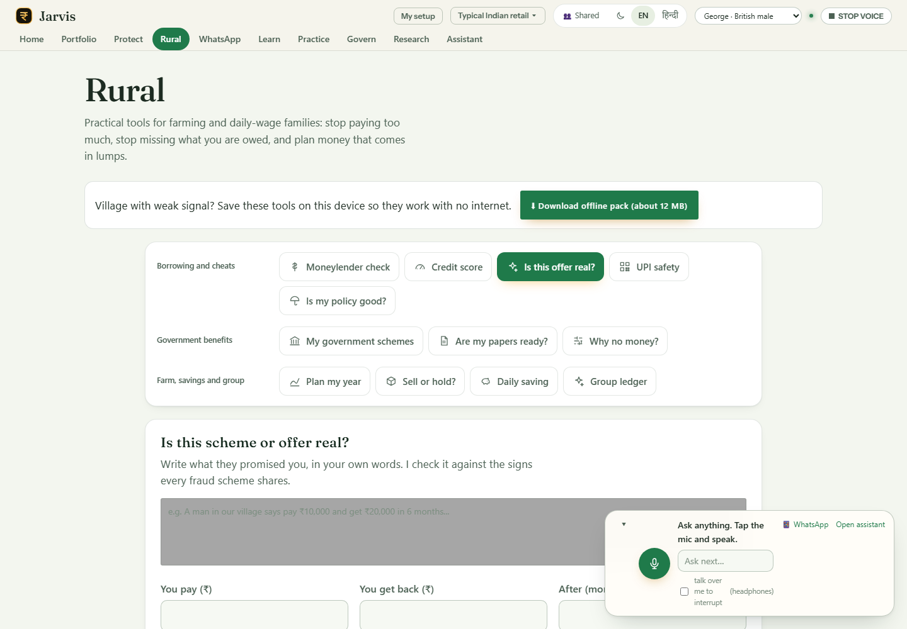 |
| **Research desk** | **Portfolio X-ray** |
| 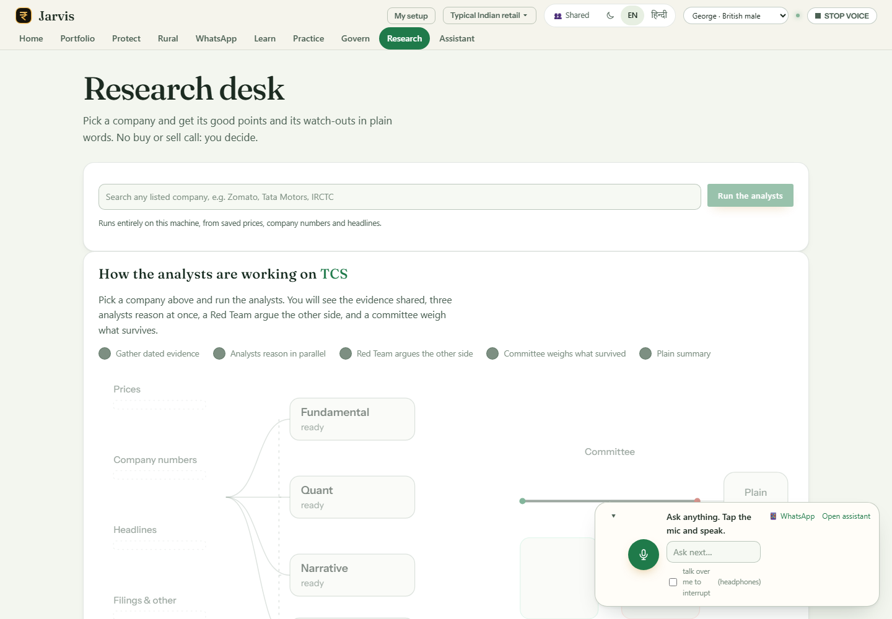 | 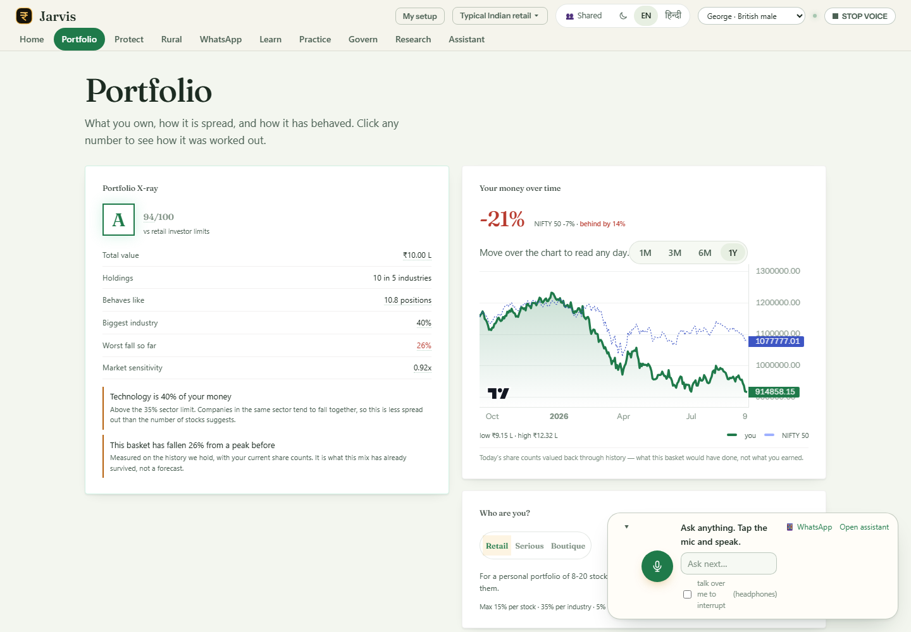 |
| **Govern and audit** | **WhatsApp chat** |
| 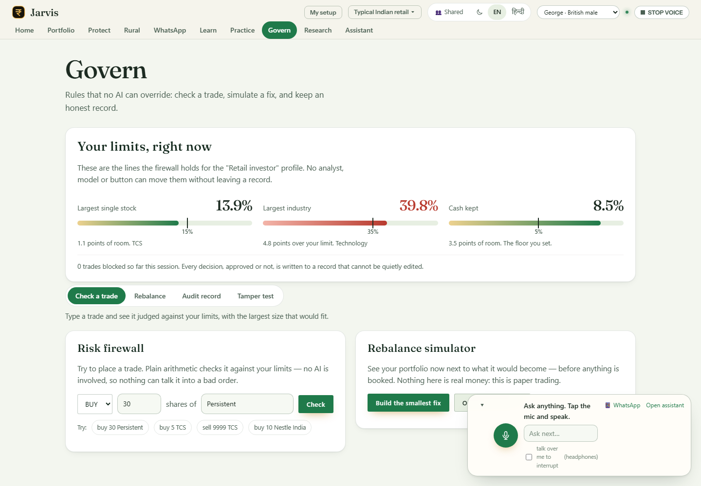 | 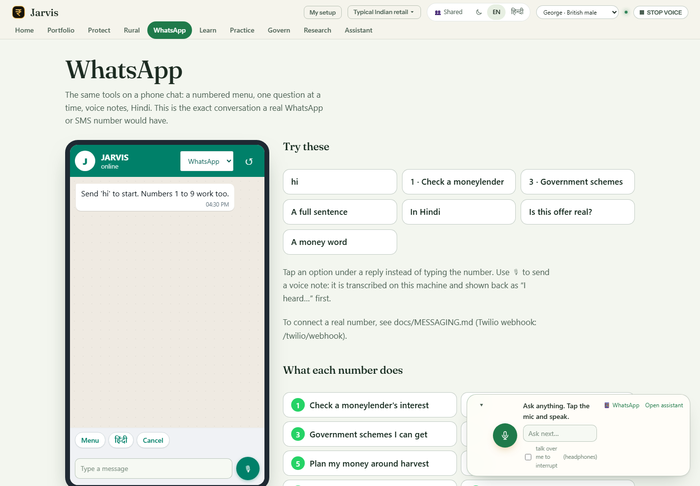 |

More older captures: [docs/FEATURES.md](docs/FEATURES.md) (fee drag, goal chart, fund overlap, emergency meter, tip scanner, ledger tamper test).

---

## The problem

Three things cost Indian households money, and each has a moment where a short, plain check would change the outcome.

| Loss channel | What it looks like | What we can cite | Status |
|---|---|---|---|
| **Digital fraud** | Panic transfers, OTP and remote-app scams, fake KYC calls | About ₹22,845 crore lost in 2024 (I4C, as reported in a 2025 summary) | Verify against the official release |
| **Informal credit** | A moneylender quotes ₹2 to ₹5 per ₹100 a month | 5% a month is 60% a year on simple interest (arithmetic). Formal KCC about 7%, about 4% with prompt-repayment relief | Arithmetic exact; rate ranges dated |
| **Fees and unverified tips** | A fund fee takes a share of long-run growth; tips without a time frame | Shown in the app with the user's own inputs | Calculation, not a survey |

Context (cited, with caveats): 27% of adults financially literate, 24% rural (NCFE 2019); about 9.5% of households in markets, about 6% rural (SEBI 2025, verify). Full sources: [docs/CONTEXT.md](docs/CONTEXT.md) section 9.

---

## The prototype

Ten features, grouped by the loss each one addresses. Home is always on. Routes are hash routes (`#/route`).

| Loss channel | Feature (route) | Tier | What it does |
|---|---|---|---|
| **Fraud shield** | Scam protection (`#/protect`) | Free | Nine scam scripts; tip checker with eight specialists; recovery coach for the first hour; tax shield; panic-sell replay; standing "tell me if" rules |
| **Credit cost** | Rural tools (`#/rural`) | Free | Moneylender check; "is this offer real?" with a score breakdown; 19 government schemes; papers checklist; harvest and wage planner; group ledger; offline once saved |
| **Investing protection** | Portfolio X-ray (`#/portfolio`) | Paid | Health grade, spread, allocation map, what-to-do list, money against the index |
| **Investing protection** | Research desk (`#/research`) | Paid | Plain company summary with confidence marks; three analyst desks and a red team; citation gate; time machine |
| **Investing protection** | Practice tools (`#/practice`) | Paid | Fund overlap, fee-drag slider, emergency-fund meter, weekly spoken digest, scam-call rehearsal |
| **Reach and trust** | Assistant (`#/assistant`) | Free | Types or speaks a question in English or Hindi; answer cards with figures, charts and steps; guided tours |
| **Reach and trust** | WhatsApp and SMS (`#/whatsapp`) | Free | The same answers on a phone chat: menu, voice notes, Hindi. Simulator today |
| **Reach and trust** | Learn (`#/learn`) | Free | 32 checked explanations in English and Hindi; goal range from the portfolio's own history; glossary |
| **Reach and trust** | Govern and audit (`#/govern`) | Paid | Risk firewall for trades; rebalance simulator; hash-chained audit record; tamper test |
| All | Setup (`#/setup`) | Free | Choose one of five baskets and switch features; a locked page adds anything not in the setup |

**Baskets** (for demonstration): full prototype; banks and co-operative banks; farmers and rural families; self-help groups and NGOs; middle-class retail investors. Every feature works in every basket. Prices shown are dummy.

---

## How a question is answered

Every typed or spoken question follows one path, whether from the assistant or WhatsApp.

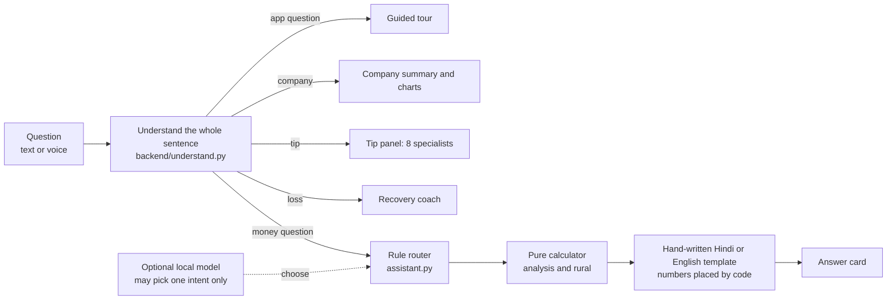

Three rules hold everywhere: the model never writes a number; the risk engine never imports a model; a translation may never change a figure.

---

## Architecture

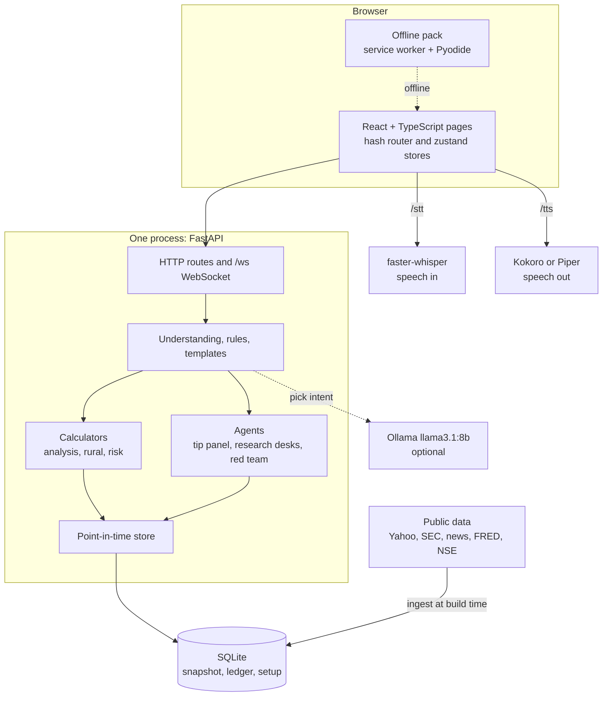

| Layer | Rule | Where |
|---|---|---|
| Truth (numbers) | Pure and deterministic; no model imported | `analysis/`, `risk/`, `backend/rural.py`, `backend/ledger.py` |
| Meaning (what was asked) | Rules first; a model may only pick one intent | `backend/understand.py`, `assistant.py`, `intents.py`, `router.py` |
| Words (how it is said) | Hand-written templates; numbers placed by code | `backend/vernacular.py`, `hindi_*.py`, `knowledge.py`, `scams.py` |

Full detail: [docs/ARCHITECTURE.md](docs/ARCHITECTURE.md), [docs/TECHNICAL_OVERVIEW.md](docs/TECHNICAL_OVERVIEW.md).

---

## Business

JARVIS is free for households. Banks, state missions, NGOs and CSR funds pay for it, because they carry the cost of the losses it prevents.

| Payer | What they buy | Why they pay |
|---|---|---|
| Co-operative and rural banks | Assistant, recovery coach, credit-cost explainer, staff audit trail | Fewer fraud losses and complaints; better rural loans |
| State missions and NGOs | Offline pack, group ledger, scheme finder | Reach with few field staff; reportable outcomes |
| CSR funds | Impact reporting built on counted events | Spend obligations with evidence |
| Urban investors | Portfolio X-ray, fee drag, research, practice | Clear value on their own money (after a SEBI opinion) |

The arithmetic is simple and is shown with its assumptions in [docs/IMPACT_MODEL.md](docs/IMPACT_MODEL.md). For a 100,000-customer bank, the assumed saving is about ₹10.6 lakh a year against a ₹3 lakh fee. Those inputs are unmeasured. The pilot in [docs/PILOT_PLAN.md](docs/PILOT_PLAN.md) exists to measure them.

Read next: [docs/BUSINESS_MODEL.md](docs/BUSINESS_MODEL.md) · [docs/COMPETITORS.md](docs/COMPETITORS.md) · [docs/PILOT_PLAN.md](docs/PILOT_PLAN.md) · [docs/BUSINESS_DATA_COSTS.md](docs/BUSINESS_DATA_COSTS.md) · [JARVIS_Learning_Guide.docx](JARVIS_Learning_Guide.docx)

---

## Quick start

Requirements: Python 3.11 or newer, Node 18 or newer. Optional: Ollama for the local model; a microphone for voice.

```bash
# 1. Install Python dependencies
pip install -r requirements.txt

# 2. Build the frontend
cd frontend && npm install && npm run build && cd ..

# 3. Run the backend (serves the app, the landing page and the API)
python -m uvicorn backend.app:app --port 8000
```

Then open:
- `http://localhost:8000/`: the landing page, which leads into the prototype
- `http://localhost:8000/index.html#/setup`: the setup screen
- `http://localhost:8000/index.html#/`: the prototype home

Developer mode with hot reload:

```bash
npm run dev --prefix frontend      # http://localhost:5173 (proxies API routes to :8000)
```

Tests:

```bash
python -m pytest tests/ -q         # 532 tests
```

Voice models and the optional local model are downloaded by the scripts in `tools/` (see [docs/VOICE.md](docs/VOICE.md)).

---

## Data

Market data comes from free public sources, frozen into `data/snapshot.db` at build time. Each source declares how trustworthy its publication dates are, so the app never shows a figure from the future.

| Data | Source | Used for |
|---|---|---|
| Daily prices, 57 symbols, 2019 to 2026 | Yahoo Finance via yfinance | Charts, tip volatility, research, X-ray |
| Fundamentals and ratios | yfinance | Company summary, tip fundamentals |
| US company facts | SEC EDGAR | US names in the universe |
| News and filings | Google News RSS, GDELT | Research desk evidence |
| Macro series | FRED, RBI and NSE series | Context |
| Scheme details | Official portals, named in `backend/rural.py` | Rural tools (static text; check before use) |
| Rates and tax constants | Stated in code, dated | Calculators (update each year) |

Every data set, its status and its licence risk: [docs/DATA.md](docs/DATA.md) and [docs/BUSINESS_DATA_COSTS.md](docs/BUSINESS_DATA_COSTS.md) section 3. Yahoo and NSE-derived data **cannot be sold as is**; a licensed feed is needed before any paid use.

---

## Documentation

| Document | What it covers |
|---|---|
| [CONTEXT.md](docs/CONTEXT.md) | The single knowledge base: problem, features, audiences, honesty rules, status |
| [TECHNICAL_OVERVIEW.md](docs/TECHNICAL_OVERVIEW.md) | Stack, agents, engines and flows per feature |
| [ARCHITECTURE.md](docs/ARCHITECTURE.md) | System diagrams, event contract, invariants |
| [FEATURES.md](docs/FEATURES.md) | Each feature with screenshots |
| [DATA.md](docs/DATA.md) | Data sources and point-in-time safety |
| [SETUP.md](docs/SETUP.md) | Setup, baskets and the demo price |
| [RURAL.md](docs/RURAL.md) | Rural tools in detail |
| [MESSAGING.md](docs/MESSAGING.md) | WhatsApp and SMS, and the Twilio route |
| [VOICE.md](docs/VOICE.md) · [LANGUAGE.md](docs/LANGUAGE.md) | Speech and bilingual design |
| [SAFETY_AND_PRIVACY.md](docs/SAFETY_AND_PRIVACY.md) | What never leaves the machine |
| [TESTING.md](docs/TESTING.md) | Test suites and how to run them |
| [BUSINESS_MODEL.md](docs/BUSINESS_MODEL.md) | Who pays, what they buy, pricing, go-to-market |
| [IMPACT_MODEL.md](docs/IMPACT_MODEL.md) | The arithmetic with every assumption marked |
| [COMPETITORS.md](docs/COMPETITORS.md) | Competitors by job, and the wedge |
| [PILOT_PLAN.md](docs/PILOT_PLAN.md) | How a pilot measures the assumptions |
| [BUSINESS_DATA_COSTS.md](docs/BUSINESS_DATA_COSTS.md) | Running costs, project costs, data sources |
| [ROADMAP.md](docs/ROADMAP.md) | What comes next |

---

## Honest limits

- **Business numbers are assumptions.** No pilot has run and no bank has used the product.
- **WhatsApp is a simulator.** Live delivery needs a Twilio account and approved templates.
- **Mutual-fund holdings are illustrative samples**, not factsheets.
- **Prices are a frozen snapshot**, not live, and cover a 53-company universe well.
- **The setup is saved once per install**, not per user. Payments are dummy.
- **The tip scanner reads English tips only.**
- **Hindi speech recognition is untested with rural speakers.**
- **The audit chain is tamper-evident, not tamper-proof.** Anchoring outside the machine is not built.
- **The offer checker reads word patterns.** It can miss new wording and has no negation handling yet.
- **No research desk beats a coin flip.** The project says so and builds around it ([GOVERNANCE_ENGINE](docs/GOVERNANCE_ENGINE.md)).
- **The local model is optional.** Without Ollama, the assistant asks instead of guessing.

---

## Tech stack

| Layer | Technology |
|---|---|
| Backend | Python 3.11, FastAPI, uvicorn, WebSocket |
| Storage | SQLite (WAL) |
| Speech | faster-whisper (in); Kokoro or Piper (out) |
| Optional model | Ollama, llama3.1:8b |
| Frontend | React 18, TypeScript, Vite, zustand, Three.js (react-three-fiber), lightweight-charts |
| Offline | Service worker, Pyodide running the rural calculators |
| Tests | pytest (532), TypeScript check, Vite build |

Hotkeys (assistant): `SPACE` hold to speak · `/` focus the box · `Esc` stop speaking · `T` presenter mode · `Ctrl+K` search everything.

---

## Licence and attribution

Research and education prototype. Market data is from free public sources; verify before relying on any figure. Not financial advice. The landing page at `landing/` was built from an external Next.js project and is served as a static build at `/landing/`.
