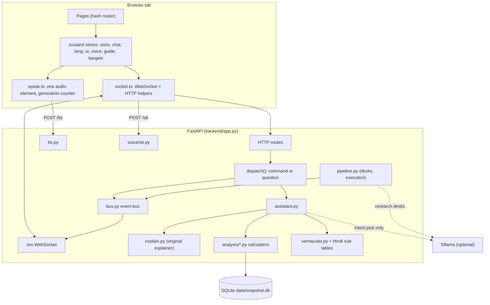
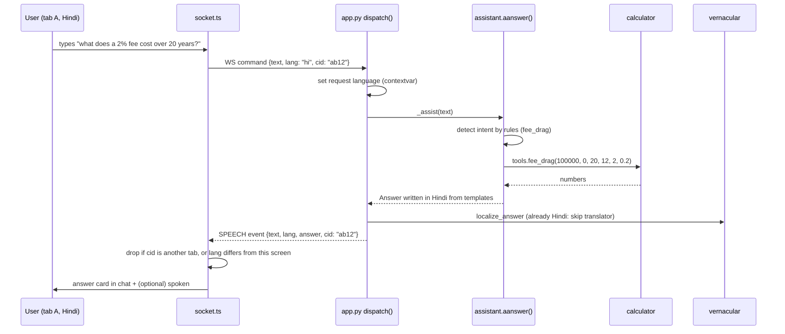
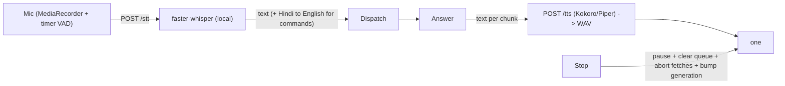
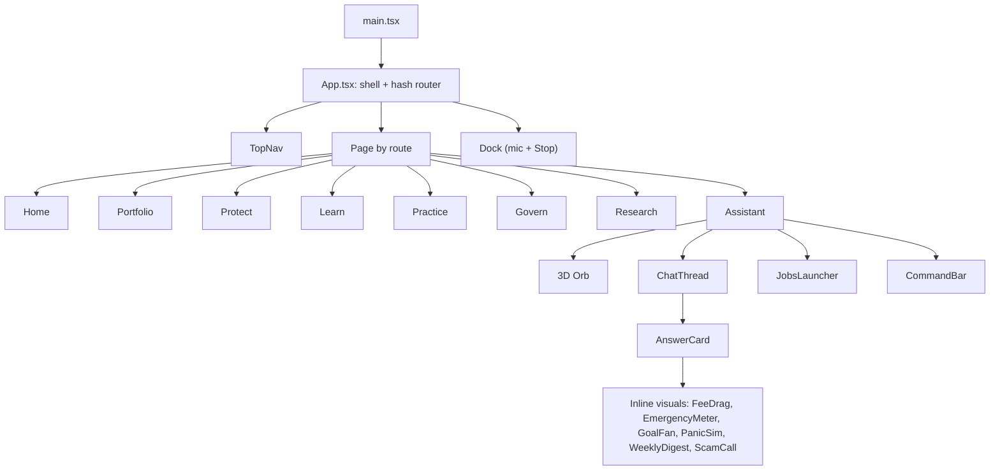

# Architecture

JARVIS is one FastAPI process plus a static React build. Everything (data, models, voices) runs on the user's machine.

## 1. System view

## 2. The three layers of the backend

| Layer | Files | Rule |
|---|---|---|
| **Truth** (numbers) | `analysis/*.py`, `risk/engine.py`, `backend/practice.py`, `backend/ledger.py`, `backend/digest.py` | Pure, deterministic, tested. No model is imported here. |
| **Meaning** (what was asked) | `backend/assistant.py`, `backend/explain.py`, `backend/intents.py`, `backend/router.py` | Rules first. A model may only choose among known intents. |
| **Words** (how it is said) | `backend/vernacular.py`, `hindi_rules.py`, `hindi_page_rules.py`, `glossary_hi.py`, `flows_hi.py`, `practice_hi.py` | Templates with numbers placed by code, English or Hindi. |

This separation is what lets the product be both friendly and verifiable.

## 3. Life of a question

Key points:

- **Per-screen language.** `LANG` on the server is only a fallback for announcements nobody asked for. Each request carries its own `lang` (a `contextvars.ContextVar` read by `_lang()`), so an English tab and a Hindi tab never override each other.
- **Own replies only.** Replies carry the asking tab's `cid`. `socket.ts` ignores events for other tabs, and ignores untagged announcements whose `lang` differs from the screen's language.
- **Stateless-ish.** Conversation memory (`explain.Conversation`) holds only the last subject, the last answer kind and the last tool question (for "explain that simpler").

## 4. Event bus and the frozen contract

`core/events.py` defines the **frozen** WebSocket contract (`PROTOCOL_VERSION = 1`): never remove or retype a field, only add optional ones. Event types cover boot, clock, transcript, intent, desk/claim/verdict, proposal, risk decision, execution, telemetry, speech and errors. `backend/bus.py` fans events out to every connected socket; speech payloads pass through `speech_filter` (`_speech_filter` in `app.py`) so announcements are language-consistent.

Replays (`recorder.py`) store the event stream **and** state snapshots, so a recorded demo is faithful even offline.

## 5. Data and state

| Store | Where | Contents |
|---|---|---|
| Snapshot | `data/snapshot.db` (SQLite, WAL) | prices, signals, documents, claims, decisions (see [DATA](DATA.md)) |
| Paper ledger | table `paper_ledger` | hash-chained, append-only (SQLite triggers refuse UPDATE/DELETE) |
| Lots | `lots` | the cost basis you typed (never guessed) |
| Portfolios | `portfolios` | saved and preset portfolios |
| Watches | `watches` | standing "tell me if" rules |
| Saved funds | `my_funds` | funds the user says they own |
| Session | memory (`backend/session.py`) | active portfolio, prices at the simulation clock, policy |

The **point-in-time store** (`core/pit.py`) is the only thing calculators read through: it filters on `published_at <= sim_clock`, so no number can see the future.

## 6. Voice path

Details in [VOICE.md](VOICE.md).

## 7. Frontend structure

Details in [FRONTEND.md](FRONTEND.md).

## 8. Runtime model

- One process: `uvicorn backend.app:app`. Startup loads the snapshot, warms the TTS engines in a thread and warms the language model.
- Background work uses `_spawn()` (tracked asyncio tasks); blocking work (TTS, Whisper) runs in threads.
- The built frontend (`frontend/dist`) is served by FastAPI; in development Vite serves it on :5173.

## 9. Invariants worth protecting

1. `risk/` never imports an LLM.
2. Calculators are pure and shared: the page slider and the chatbot call the **same** function, so they cannot disagree (tested).
3. A translator may never change a number (`numbers_preserved` guard).
4. `core/events.py` is frozen.
5. Raw audio and portfolios never leave the machine.
