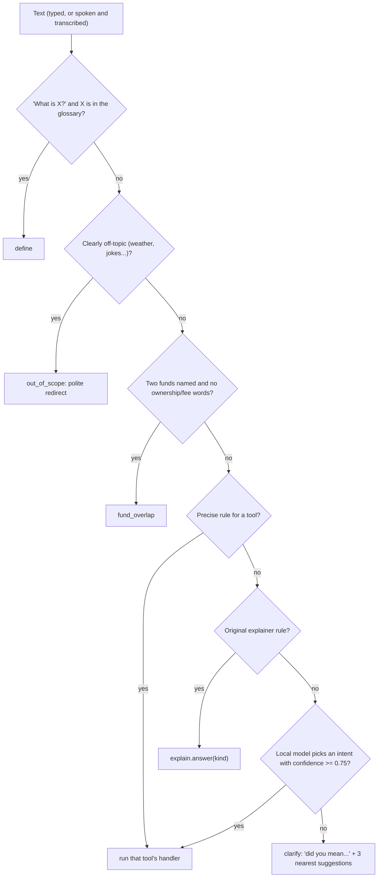

# The assistant: how it decides, and how accurate it is

The assistant's job is to be **right, not merely fluent**. Its design follows from one idea: *the model never produces a number.* Every figure is computed in Python by a calculator that the Practice-page sliders also use, so a number typed into a slider and the same number asked aloud can never disagree.

Code: `backend/assistant.py` (routing + handlers), `backend/intent_data.py` (training examples), `backend/explain.py` (original portfolio explainer), `backend/vernacular.py` (Hindi).

## 1. Decision order

1. **Precise rules** (regular expressions) for each tool. Trusted: never overruled by the model.
2. **The original explainer's keyword rules** (risk, sell, stress, diversification, correlation, should-I-buy). On a *long* sentence (8+ words) matched only by one of these loose rules, the model may overrule if it is confident, because a stray word like "fall" can mislead them.
3. **Local-LLM intent picker** (`aanswer`, Ollama `llama3.1:8b`, temperature 0, 8 s timeout). It must choose **one intent from a closed list** and return a confidence. Below 0.75, or on any error, it is ignored. It never writes the answer.
4. **Ask.** If still unsure, the assistant asks. A TF-IDF similarity model trained on `intent_data.py` *suggests* the three nearest things it can do (it is not allowed to decide: measured leave-one-out it was right only about half the time, and a confident wrong answer is worse than a question).

## 2. Intents and handlers

| Intent | Example | Handler computes |
|---|---|---|
| `fund_overlap` | "which of my mutual funds overlap?" | `practice.overlap` for a pair, a ranking of all pairs, or the user's saved funds |
| `fund_list`, `fund_info` | "what does the banking fund hold?" | sample-fund catalogue and holdings |
| `fund_vs_direct` | "which of my stocks are already in that fund?" | share of direct holdings inside a fund |
| `my_funds_add/remove/show` | "I own the technology fund" | the `my_funds` table |
| `fee_drag` | "2% fee over 20 years on 5 lakh" | `tools.fee_drag` (parses amount, SIP, years, fees, return) |
| `emergency` | "3 lakh, I spend 40000 a month" | `tools.emergency` |
| `goal` | "will 10000 a month reach 50 lakh in 15 years?" | `goal.fan` on the portfolio's own history |
| `panic` | "what if I'd sold in the Covid crash?" | `panic.replay` |
| `digest` | "my weekly digest" | `digest.build` |
| `scam_help` | "someone asked for my OTP" | rules that explain the red flags, or a recovery checklist (1930, cybercrime.gov.in) |
| `tip_scan` | "is this telegram tip legit: ..." | `scanner.scan` |
| `ledger` | "has my record been tampered with?" | `ledger.verify` |
| `predict` | "which stock will double?" | a refusal and what it *can* do |
| `help`, `chitchat`, `out_of_scope`, `clarify` | | fixed replies and suggestions |
| legacy: `xray`, `why`, `fix`, `stress`, `diversification`, `correlation`, `should_buy`, `define`, `simplify` | | the original explainer |

If a handler lacks a needed figure (for example, monthly spending) it **asks for it with an example** instead of guessing.

## 3. What an answer is

`explain.Answer` carries: `headline`, `bullets`, `action`, `detail` ("how this was worked out"), `facts` (chips), `table`, `visual` (a button that opens or inlines the matching tool, with its parameters), `follow_ups` (English questions that route correctly) and `follow_ups_hi` (labels), `lang` and an optional fixed `speech`.

- **Language:** every handler writes both languages from templates (`t(en, hi)`); an answer marked `lang="hi"` skips the translator entirely.
- **Explain-back levels:** "simpler" and "show the maths" re-run the same question; for tool answers the previous question is replayed (`convo.last_question`).
- **Chips are guaranteed useful:** a test asserts every suggested follow-up routes to a real intent, never to `clarify`.

## 4. Slot extraction (`analysis/tools.py`)

`quantities(text)` understands `5 lakh`, `₹3,50,000`, `10k`, `1.5 cr`, `2%`, `2 percent`, `20 years`, `20-yr`, `6 months`. `money_roles` separates a lump sum from a monthly amount using cues ("SIP of", "a month", "per month"). Fee parsing tells a *fee* percentage from a *return* percentage by the words around it. These are unit-tested.

## 5. Saved funds

`my_funds(fund_id, added)` lives in the session database. Funds are matched by alias; a *weak* alias ("tech", "banking") counts as a fund only if the sentence also says "fund", so "is TCS a tech stock?" never becomes a fund question.

## 6. Measured accuracy

We wrote **fresh sentences after the rules were last tuned** and recorded the first-run result *before* changing anything for that set. (After a set is used to add rules it scores ~100%; that is regression cover, not generalisation.)

| Set | Rules only: right / asked / confidently wrong | Rules + local model |
|---|---|---|
| Blind set 3 (43 longer, indirect sentences) | 18 / 20 / 5 (42%) | 35 right of 43 (81%), 6 wrong |
| Blind set 4 (36, including 8 typed-Hinglish) | 17 / 18 / 1 (47%) | 34 right of 36 (94%), 2 wrong |

Reading the table:
- Rules-only mostly **asks** rather than guessing; that is the safe failure.
- The local model recovers most paraphrases and typed Hinglish (it needs Ollama running).
- The two wrong in set 4 were a definition-vs-holdings confusion (fixed by a rule) and a tip-scan vs scam-help mix-up (both give useful answers).
- Tests assert **zero confident-wrong answers** offline on every blind set, and that every figure equals the calculator output. See [TESTING.md](TESTING.md).

## 7. How to add an intent

1. **Calculator first.** Put the maths in `analysis/` or `backend/practice.py` as a pure function with unit tests.
2. **Rule.** Add a `(name, regex)` entry to `_RULES` in `assistant.py` (more specific entries earlier). Add a guard in `rule_intent` if it needs entities.
3. **Handler.** Write `h_<name>(text, ctx)` returning an `Answer`; write both languages with `t(en, hi)`; add follow-up chips (`_FU` / `_chips`); register in `HANDLERS` and `NEW_KINDS`.
4. **Training examples.** Add 6-12 paraphrases to `intent_data.py` (used for "did you mean" suggestions) and an entry in `INTENT_DOC` (for the model fallback).
5. **Hindi.** Hindi text for any backend sentences it emits goes in `hindi_page_rules.py` (see [LANGUAGE.md](LANGUAGE.md)).
6. **Tests.** Add sentences to a *new* blind set, record the first-run score, then tune.
7. **Visual (optional).** Return `visual={"page": ..., "params": {...}}`; to play it inline, add the component to `AnswerCard.tsx`.

## 8. Failure behaviour

| Situation | Behaviour |
|---|---|
| Ollama not running | rules still work; unmatched questions ask |
| Number missing from the question | asks for it, with an example |
| Unknown fund name | says it only knows the sample funds |
| Wants a prediction | refuses and offers a stress test or a tip check |
| Gibberish | `clarify`, never a portfolio summary |
