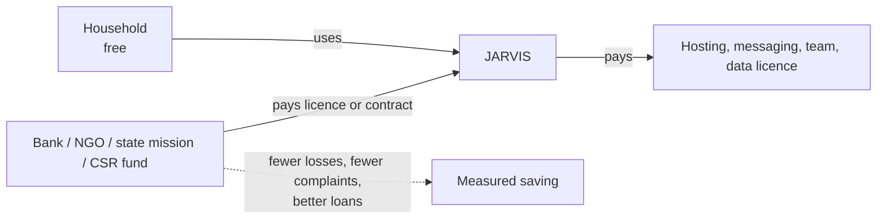

# Business model

JARVIS is a free, local protection tool for households, paid for by the institutions that carry the cost of household losses. This page says who pays, what they buy, why they pay, and what has to be true before money changes hands. Numbers here are **assumptions** until a pilot measures them; see [IMPACT_MODEL.md](IMPACT_MODEL.md) for the arithmetic and [PILOT_PLAN.md](PILOT_PLAN.md) for how to test it.

## 1. The one-line model

Free for the household. Paid by the bank, the state programme or the CSR fund that carries the loss.

## 2. Who pays and what they buy

| Payer | The loss they carry | What they buy | Price shape (to validate) |
|---|---|---|---|
| **Co-operative and rural banks** | Fraud complaints and reimbursements; borrowers pushed to moneylenders; weaker rural loans | White-label WhatsApp and SMS assistant; first-hour recovery coach; credit-cost explainer; Govern and audit for staff | Annual licence per customer band (or per branch), plus set-up fee |
| **Regional rural banks, small finance banks** | Priority-sector targets; default risk on small rural loans | Same tools, linked to their own KCC and SHG products | Enterprise licence per branch count |
| **State missions and NGOs** | Programme outcomes they must report; too few field staff | Offline pack, group ledger, scheme finder, Hindi and regional training | Contract per district per year |
| **CSR funds** | Spend obligations that need evidence | Impact dashboard built on counts the product records | Annual reporting subscription |
| **Urban retail investors** | Hidden fund fees; overlapping funds; unverified tips | Portfolio X-ray, fee drag, fund overlap, research desk, practice tools | Monthly or yearly per-feature subscription |
| **Households (rural, scam victims)** | Losses, and no safety net | Everything in the protection tier | **Free, always.** Never paywalled |

## 3. Why an institution pays

- **A bank pays to avoid losses it already carries.** A fraud complaint costs staff time and sometimes a reimbursement. A guided first hour and a documented process reduce both.
- **A bank pays to keep a better loan book.** A borrower who can see the cost of a moneylender quote can be moved to KCC or SHG credit.
- **A state mission pays for reach.** An offline tool that serves a village without a smartphone multiplies a small field team.
- **A CSR fund pays for evidence.** It needs reportable outcomes, and the product can count real events.

The honest caveat for every buyer: the saving is not yet measured. The first contract should be signed on a pilot that produces the number.

## 4. Why an individual can be charged, and when not

| Individual | Charge? | Why |
|---|---|---|
| Urban investor | **Yes**, a small subscription | Analyses their own holdings, fees and research. Comparable to a budgeting or research app. Needs a SEBI opinion before research is sold. |
| Rural household | **No** | The people with least money carry the most risk. A paywall on fraud protection makes the problem worse. |
| Scam victim | **No** | A one-off urgent need. A subscription at the moment of loss is the wrong offer. |

## 5. The advantage

| Advantage | Why it matters to a buyer |
|---|---|
| Deterministic numbers: one function serves the page and the chatbot | Trust comes from numbers that do not change between screens |
| Local first: speech, models and personal data stay on the machine | Eases data-protection concerns under the DPDP Act 2023 |
| Hindi and English written by hand, with a check that translation never changes a number | Rural users get the right words, and figures stay correct |
| First-hour recovery workflow with drafts and helpline routing | A specific product for a specific urgent moment |
| Audit trail for advisers and banks | Useful for compliance (tamper-evident, not yet anchored) |
| Free core for the people the problem is about | Makes NGO and state partnerships easier |

Honest limits: the code is copyable, the Hindi content is the harder asset to replicate, and distribution through a bank or state programme is the real moat.

## 6. Revenue lines

| Line | Who | How it is priced | Status |
|---|---|---|---|
| Institution licence | Banks, RRBs, SFBs | Per customer band or per branch per year | Not sold; demo prices only |
| Programme contract | State missions, NGOs | Per district per year, with training | Not sold |
| CSR reporting | CSR funds | Annual subscription | Not sold |
| Investor subscription | Urban retail | Per feature per month | Demo prices only; needs SEBI opinion |

The demo prices in the app (₹99 to ₹597 a month) are placeholders. Set real prices only after a pilot shows the saving.

## 7. Go-to-market route

1. **Pilot partner.** One NGO or co-operative bank, with an agreed outcome measure written before the start.
2. **Field work.** Use the offline pack and group ledger with the partner's staff in one district or one set of branches.
3. **Paid licence or programme contract.** Signed on the pilot numbers.
4. **Channel partner.** A WhatsApp business platform (Gupshup, Yellow.ai, Haptik, Kaleyra) for scale; JARVIS plugs into their rails.
5. **Investor tier.** Opened once the legal opinion is in hand.

## 8. Break-even in one line

The team and data costs need about 22 banks of 100,000 customers at the assumed price, or a mix with NGO and CSR contracts. See [IMPACT_MODEL.md](IMPACT_MODEL.md) section 4.

## 9. What must be true before asking for money

1. A signed pilot with one written outcome measure.
2. A licensed market-data feed, if any investor tool is charged.
3. A written SEBI opinion on the research desk and tip checker.
4. Field testing of Hindi speech with rural speakers.
5. Accounts and login, so the setup is per user, not per install.
6. Current messaging rate cards from the provider, which set the margin per customer.

## 10. Risks

| Risk | What it would mean | Response |
|---|---|---|
| Slow institutional sales | 6 to 12 months from first meeting to contract | Start with NGO and CSR pilots |
| Public-sector procurement | Slow and political | Partner with an NGO that already works with the state |
| Messaging cost | Can erase the margin per customer | Price per customer, cap conversations, use cheaper channels, or pass through at cost |
| Data licence | yfinance and NSE-derived data cannot be sold as is | License a feed before any investor charge |
| Platform copy | A large app adds a Hindi finance module | Compete on partnerships, verified content and outcome data |
| Regulatory | Research or lending features can trigger licensing | Keep advice out; get written opinions first |

## See also

[IMPACT_MODEL.md](IMPACT_MODEL.md) · [COMPETITORS.md](COMPETITORS.md) · [PILOT_PLAN.md](PILOT_PLAN.md) · [BUSINESS_DATA_COSTS.md](BUSINESS_DATA_COSTS.md) · [JARVIS_Learning_Guide.docx](../JARVIS_Learning_Guide.docx)
