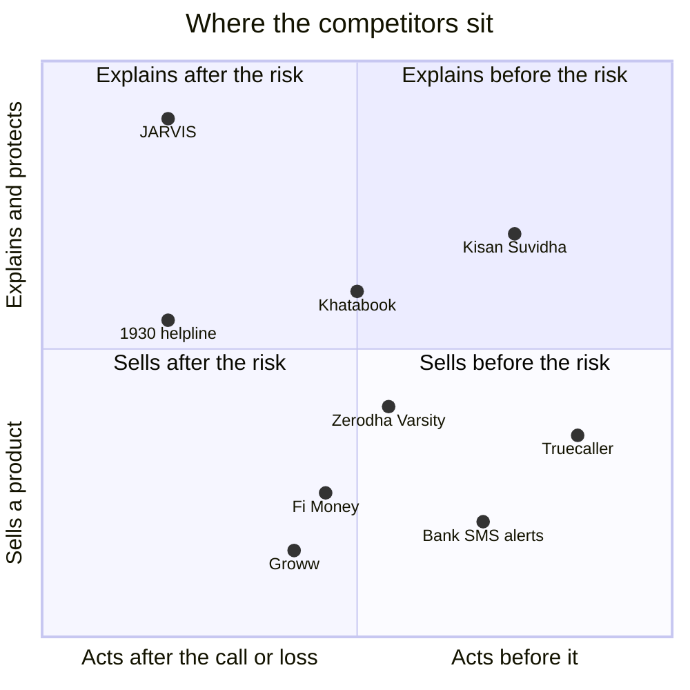

# Competitors

JARVIS is compared with competitors by the **job** each one does for the user, not by product category. A competitor is a substitute for the job. The full research, with sources and tables, is in [JARVIS_Learning_Guide.docx](../JARVIS_Learning_Guide.docx) section 10. Items not checked are marked **VERIFY**.

## 1. The map

Positions are qualitative judgments for orientation, not measurements.

## 2. Scam protection

| Player | What it does | Where JARVIS differs | Relationship |
|---|---|---|---|
| Truecaller (Scam Checker, Scamfeed, Family Protection) | Labels and blocks calls and messages before they arrive | Works after the call: the script, a rehearsal, the first hour | Complement |
| Bank SMS alerts and bank apps | Transaction alerts; card blocking; complaint forms | Explains what to do and in what order | Complement; a bank is also a buyer |
| 1930 helpline and cybercrime.gov.in | Official reporting; freezing money if reported fast | A guide to using them well, in Hindi, with drafts | Complement |
| Government and NGO awareness content | Awareness only | Interactive rehearsal and checklist | Competes for attention |

## 3. Investing education and portfolio tools

| Player | What it does | Where JARVIS differs | Relationship |
|---|---|---|---|
| Zerodha Varsity | Free investing course from a broker | No product sold; explains the user's own numbers; Hindi on WhatsApp | Stronger on depth; weaker on language and personal numbers |
| Groww | Learning and a broker or fund platform | Teaches in general without sending the learner to its own products | Large distribution; direct rival for first-time investors |
| Fi Money | Money account with a conversational interface | Explains rather than executes | Competitive for urban users |
| ET Money and portfolio trackers | Holdings and returns | Adds fee drag in rupees and fund overlap | VERIFY feature overlap before any claim |
| Scripbox and similar advisers | Assisted fund advice for a fee | No advice given; a registered adviser is the right route | Different job; possible partner |

## 4. Rural credit and farmer information

| Player | What it does | Where JARVIS differs | Relationship |
|---|---|---|---|
| Kisan Suvidha (government app) | Weather, prices, input information | Tells the farmer what a loan costs and which benefit is owed | Complement; should link |
| Bank KCC and SHG desks | Formal credit | Compares the informal quote with the formal one in rupees | Partner and buyer |
| Informal lenders | Fast cash at high rates | Makes the cost visible at the decision | The problem itself |

## 5. Group ledgers and self-help groups

| Player | What it does | Where JARVIS differs | Relationship |
|---|---|---|---|
| Khatabook | General business ledger with a large base | Models a group's savings, internal loans, fines and meeting report; works offline | Different segment |
| DigiKhata | Digital ledger for small shops | A group, not a shop | Different segment |
| Paper registers and NGO spreadsheets | The current default for most SHGs | Digital report, offline, Hindi | **The real competitor**: habit and cost of change |

## 6. WhatsApp and conversational platforms

| Player | What it does | Where JARVIS differs | Relationship |
|---|---|---|---|
| Gupshup, Yellow.ai, Haptik (Jio), Kaleyra (Tata Communications) | Business messaging and chatbot platforms | JARVIS is the content and calculation engine that plugs into these rails | Partner: the channel a bank buys |
| Government WhatsApp services | Official service channels in some states | VERIFY coverage | Possible partner or competitor |

## 7. What the picture says

- No competitor combines all four: after-the-call scam recovery, personal-number checks in Hindi, offline calculators, and an audit trail for institutions. That combination is the wedge.
- Most competitors are either channels (Truecaller, banks, WhatsApp platforms) or products to sell (brokers, fund platforms). JARVIS is neither. That helps trust and makes revenue harder.
- The biggest threat is distribution: a large platform adding a Hindi finance module to an app people already use.
- The defensible assets are institutional integrations, verified Hindi content, scheme data kept current, and outcome data from pilots. The code alone is easy to copy.
- Before any sales conversation, recheck every feature claim about a competitor.
