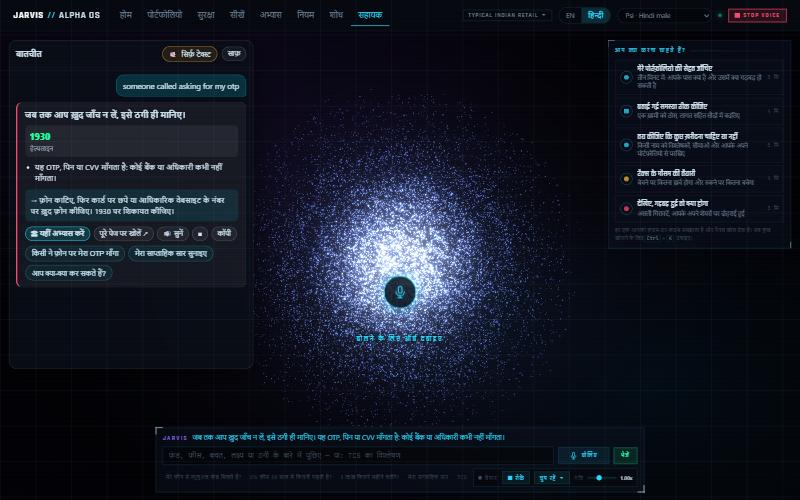
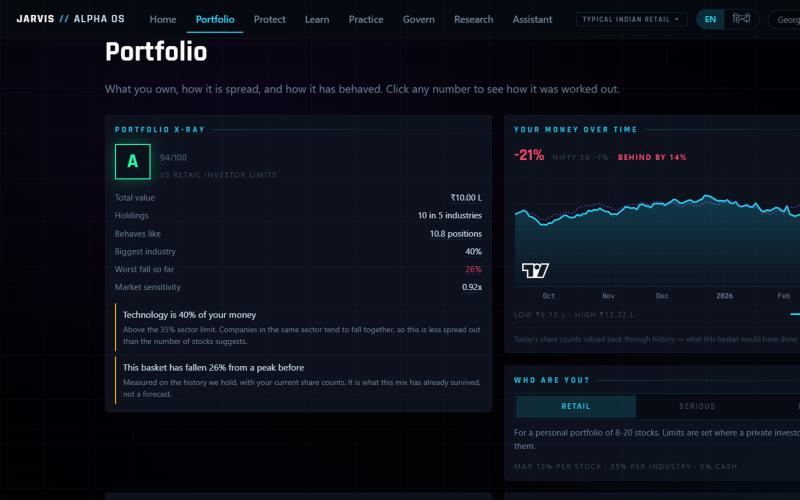
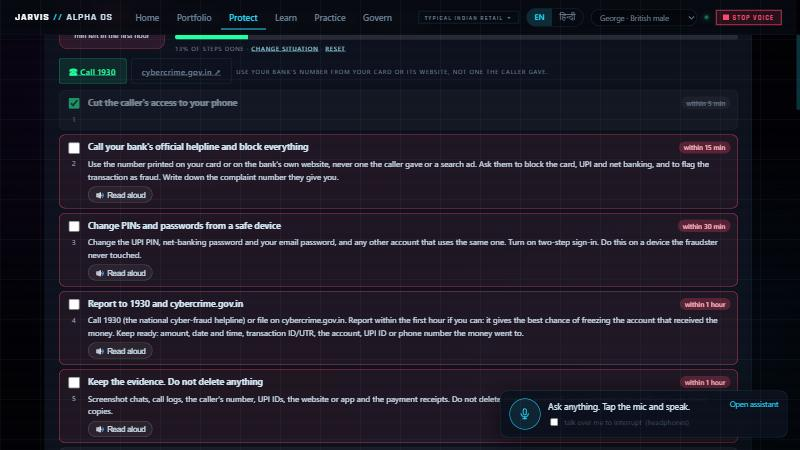
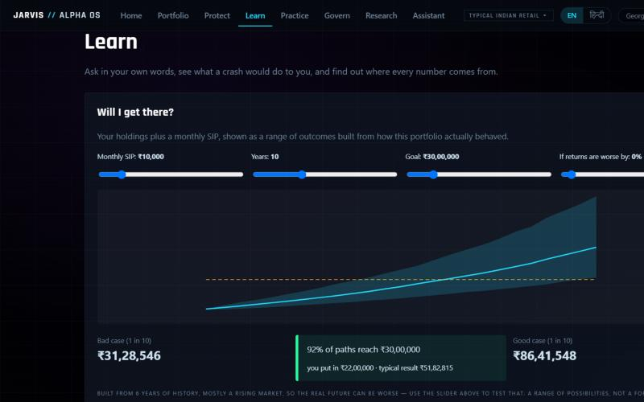
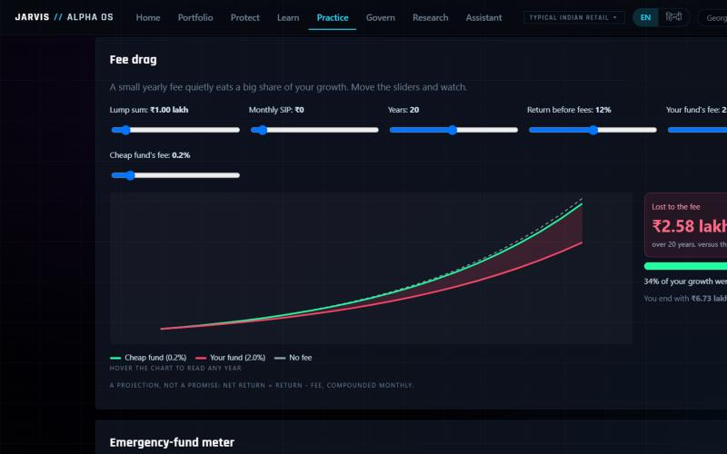
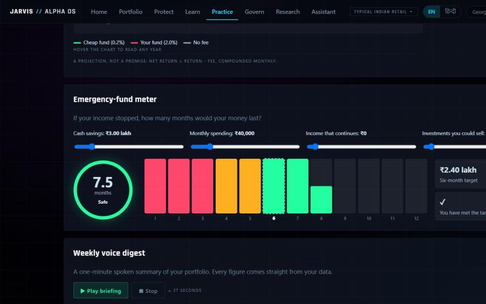
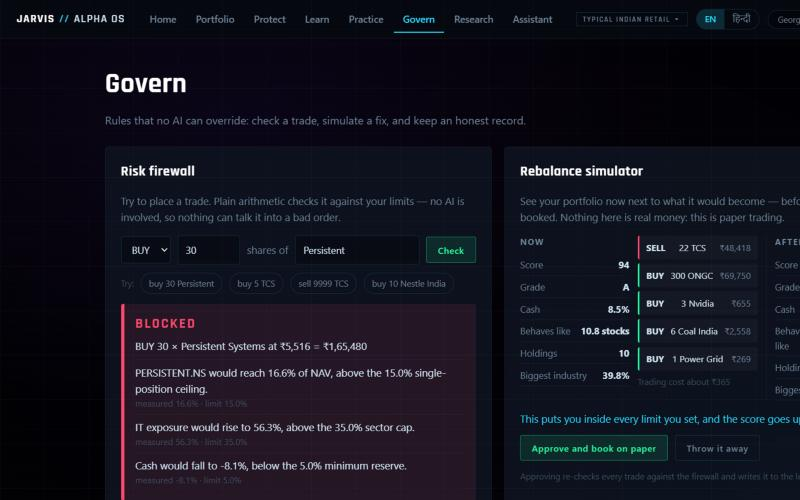
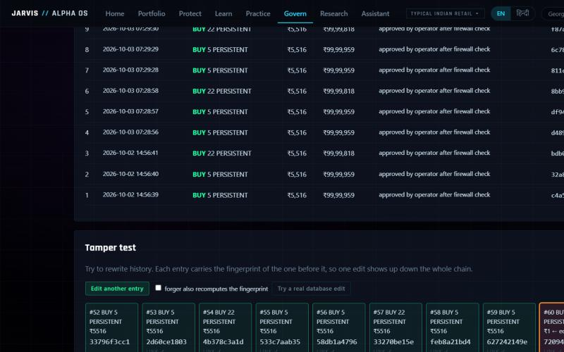

# Features

Every feature, who it helps, how it works, and where it stops. Screens are from the running app (English; every one also works in Hindi).

**Contents:** [Assistant](#assistant) · [Portfolio](#portfolio) · [Protect](#protect) · [Learn and Practice](#learn-and-practice) · [Govern](#govern) · [Research](#research) · [Guided jobs](#guided-jobs) · [Cross-cutting](#cross-cutting)

---

## Assistant

**What it is:** a voice and text chatbot built around a 3D orb. Ask by tapping the orb (or `SPACE`), typing, or tapping a suggestion. Answers appear as **structured cards**.

**Who it is for:** anyone who would rather ask than hunt through screens, including people who prefer to listen or speak Hindi.

**What an answer card contains**

| Part | Purpose |
|---|---|
| Headline | the one-line answer |
| Key figures | 2-4 chips (e.g. overlap %, fee lost, months of cover) coloured good / warn / bad |
| Table | e.g. yearly fee comparison, shared stocks, month-by-month cash |
| Bullets and "what to do next" | the reasoning, in plain words |
| "How this was worked out" | the formula and assumptions, collapsible |
| **Inline visual** | the matching interactive tool, playable inside the chat |
| Follow-up chips | the next sensible questions |
| Read aloud / Stop / Copy | per-card controls |

**Voice + text switch.** A toggle in the chat header chooses *Voice + text* or *Text only*. Text only never requests audio; a card's **Read aloud** button still speaks on demand.

**Inline visuals** (press "Try it here"): fee drag, emergency meter, goal chart, panic replay, weekly digest, and the scam-call rehearsal. Each starts from the figures the answer used.

**What it understands:** funds and overlap, fees, emergency cash, goals, panic-selling, weekly digest, scam help, tip checks, the ledger, definitions, and the original portfolio questions (health, risk, what to sell, stress, diversification, correlation, should-I-buy). It refuses to predict prices. Details: [ASSISTANT.md](ASSISTANT.md).

**Saved funds.** Say "I own Large Cap Fund A and Bluechip Fund B"; later ask "which of my mutual funds overlap?". Stored in the local `my_funds` table.

---

## Portfolio

**What it does:** shows what you own and how it behaves.

| Piece | Meaning |
|---|---|
| **Grade and score** | 0-100 against *your chosen* limits; the formula is published |
| **Effective holdings** | `1/HHI`: "you own 10 stocks but it behaves like 6" |
| **Findings** (max 5) | ranked by severity, in plain language |
| **Your money over time** | today's share counts valued back through history vs the NIFTY |
| **Profiles** | Retail (15% per stock / 35% per sector / 5% cash), Serious private investor (10 / 35 / 8), Boutique fund (5 / 30 / 10) |
| **Bring your own** | load a preset, search and pick, or **paste from your broker**; unreadable lines are returned, never silently dropped |

Why profiles exist: pointing institutional limits at a 10-stock portfolio produced 13 red findings and a grade E, which is an alarm, not a diagnosis. The same portfolio now reads 94 A / 83 B / 51 D depending on the yardstick, and the screen always says which.

---

## Protect

### Scam recovery coach

**Problem:** after a scam, people lose the first hour to panic, shame and not knowing the sequence.

**How it works** (`backend/recovery.py`, `frontend/src/pages/Recovery.tsx`):
1. Pick what happened (six situations: money taken via UPI/card, shared an OTP/PIN, installed a remote app, paid a fake investment, a fake police/"digital arrest" transfer, clicked a link).
2. Get an **ordered plan** for *that* situation (for example a remote app starts with "cut the caller's access"; a fake investment starts with "stop paying"). Each step has a deadline chip ("within 15 minutes", "within 3 working days") and a plain explanation; urgent ones open by themselves.
3. A **first-hour clock** (set when it happened) counts down; steps tick off and your progress is remembered on this device.
4. **Ready-to-send drafts**, filled with only the details you type (gaps stay `[in brackets]`): a 30-second phone script for the helpline or bank, the text for cybercrime.gov.in, and a written dispute letter to the bank. Copy buttons; nothing is sent from the app.
5. One-tap **Call 1930** and a link to cybercrime.gov.in; every step can be read aloud, in English or Hindi.

In the assistant, "I lost 50000 on UPI to a fake bank officer" or "my mother was scammed" returns the first steps as a card with the full coach playable inline. It never promises a refund; it states that who bears the loss depends on whose lapse it was and tells you to ask in writing.

### Stock-tip scanner

**Problem:** Telegram / WhatsApp / Instagram "sure shot" tips.

**How it works** (`analysis/scanner.py`, no AI opinion):
1. Seven pattern families flag scam *tactics* (guaranteed returns, huge multiples, urgency, inside knowledge, paid/private groups, ignore-losses, SEBI-registration claims). Each has a point weight and a plain reason.
2. It finds companies named and tests numeric **claims** ("profit up 300%") against dated filings; targets far above the last close are marked as classic pump markers.
3. Output: a 0-100 score on a gauge, the tip text with scam phrases highlighted, the tactics with reasons, claims marked supported / contradicted / unverified, and a verdict (*likely pump or scam / caution / no red flags found, still not advice*).

**Limit:** English tips only. A checker, not advice.

### Tax shield

**Problem:** selling a few weeks early costs real money.
**How it works** (`analysis/shield.py`, `analysis/tax.py`): short-term gains 20% (Sec 111A), long-term 12.5% (Sec 112A), first ₹1.25 lakh of long-term gains per year exempt, one-year threshold. For each holding it shows days held, gain, tax if sold today, and what waiting would save. **Cost basis is only what you type**; without it the row says "add what you paid".
**Limit:** arithmetic on published rates, not tax advice; rates change with budgets.

### Panic-sell replay

**Problem:** selling at the bottom.
**How it works** (`analysis/panic.py`): your current holdings valued at real closing prices through the Covid crash, the 2022 rate shock or the Jan 2023 selloff. Drag the "day you sell" slider; compare *sold* (locked in) with *held*. It shows the cases where holding did **not** win.

### Standing rules ("Tell me if...")

You say once what would worry you ("cash below 5%", "technology above 45%"). `backend/watchlist.py` re-evaluates when the portfolio moves and announces only the rules that *flipped*, so the channel never becomes noise.

---

## Learn and Practice

### Goal chart ("Will I get there?")

Your portfolio plus a monthly SIP, shown as a **range** (10th / median / 90th percentile) with the chance of reaching a target. `analysis/goal.py` resamples monthly-sized blocks of the portfolio's own past returns (so crashes stay in) over 2,000 paths. A "returns are worse by X%" slider tests a harsher future. It states that the history is ~6 years of a mostly rising market.

### Fund overlap checker

Pick two of eight sample funds. Ribbons join shared stocks (thickness = shared weight); a ring shows overlap %; it shows the **fee wasted per ₹1 lakh** and how much of your *own* holdings the funds already contain. Overlap = sum over shared stocks of the smaller weight, as a share of the smaller fund. The star lets you mark funds you own (the chatbot remembers). **Sample data, labelled as such.**

### Fee-drag slider

Sliders for lump sum, SIP, years, return and two fees. Shows growth with no fee, with a cheap fund and with yours, the gap shaded, and "% of your growth the fee ate". Net return = gross - fee, compounded monthly, contributions at month end (`analysis/tools.fee_drag`, tested against a closed form).

### Emergency-fund meter

Cash, monthly spending, income that continues, and sellable investments (with a 20% crash haircut). Month bars drain red -> amber -> green with a marker at six months, plus the shortfall and the monthly saving that closes it in a year (`tools.emergency`).

### Weekly voice digest

A ~40-second briefing: this week's gain/loss, best and worst holding, risk score and biggest slice, and one rotating safety tip. Fixed templates, so no number is paraphrased. It plays **section by section** with the current line highlighted; any Stop ends the whole briefing.

### Scam call rehearsal

Three scripted scenarios (bank KYC / OTP, "digital arrest", WhatsApp investment group), in **English or Hindi**. The phone rings; you answer by tapping a suggested reply, typing, or **speaking** (local Whisper). A deterministic classifier labels each reply *refuse / verify / stall / comply*: giving a code, installing an app or transferring money **loses**; refusing or hanging up **wins**. Red-flag chips pop as the caller uses each tactic; a pressure meter rises; the end card lists the tactics used and the "Stop, hang up, call the official number or 1930" rule. *Hands-free* mode opens the mic after the caller finishes. Replies tolerate transcription misspellings and codes spoken as words.

### Glossary and "every number is a door"

Click any underlined figure (Learn page) to open its components, the formula, why it matters, and the exact prices and dates it came from (`backend/drilldown.py`).

### Stress tests

Four real windows (Covid crash, Covid recovery, 2022 rate shock, Jan 2023 selloff) and four labelled what-ifs, replayed against your share counts. The UI tags **REAL** vs **WHAT-IF**.

---

## Govern

### Risk firewall

Try any trade. `risk/engine.py` checks single-position, sector and cash limits with plain arithmetic and, if blocked, solves in **closed form for the largest compliant size**. No model is involved, so nothing can talk it into a bad order.

### Rebalance simulator

Shows *now* beside *after* (score, grade, cash, effective holdings, biggest industry), the trades, trading cost and tax, and a plain verdict, before anything is booked. Approving re-runs every trade through the firewall and writes to the ledger (paper only).

### Audit ledger and tamper test

Every booked trade stores the hash of the previous one, so editing history breaks the chain at that row; SQLite triggers also refuse UPDATE and DELETE. The **tamper test** edits an entry *in memory*: the chain turns red from that row onward; a "forger recomputes the fingerprint" mode shows the damage surfacing one row later; "Try a real database edit" attempts a genuine UPDATE and shows the database refusing it (rolled back either way).

---

## Research

Four AI analysts (Fundamental, Quant, Narrative, ...) and a forced dissenter (Red Team) study a company. Claims must cite real evidence ids or are dropped; agreement among correlated analysts is flagged as **groupthink** and conviction is halved. A **time machine** rewinds the clock so analysts only see what was known on that date. A calibration record scores every desk, and no desk beats a coin flip. Full story: [GOVERNANCE_ENGINE.md](GOVERNANCE_ENGINE.md).

---

## Guided jobs

Nine step-by-step flows on the Assistant page, each opening the right panels for you: *Check my portfolio's health, Fix a problem you told me about, Decide whether to buy something, Get ready for tax season, See what happens if it goes wrong, Put idle cash to work, Rebalance the whole portfolio, Add what you paid, Set this up for my money.* Steps are spoken and fully bilingual (`backend/flows.py`, `flows_hi.py`).

---

## Cross-cutting

| Capability | Where |
|---|---|
| Local neural voices; instant Stop; voice picker; pace control | [VOICE](VOICE.md) |
| English / Hindi per screen | [LANGUAGE](LANGUAGE.md) |
| Everything runs on the user's machine | [SAFETY_AND_PRIVACY](SAFETY_AND_PRIVACY.md) |
| Command palette (`Ctrl+K`), presenter mode (`T`), recorded replay (`R`) | [GOVERNANCE_ENGINE](GOVERNANCE_ENGINE.md) |
| **Next Best Action queue**: the app proposes a short ranked list of things worth doing (by stake and deadline), each attached to the guided job that resolves it | `backend/actions.py`, `GET /actions` |
| **One-page report** you can print or keep: position, findings, what to do, what it survived, tax cost and the provenance of every figure | `backend/report.py`, `GET /report` |
