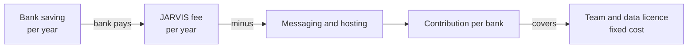

# Impact model

This page is the arithmetic behind the business case. **Every input marked [A] is an assumption, not data.** No pilot has run, and no bank has used JARVIS. The model shows how the numbers fit together so that a pilot can replace the assumptions with measured counts.

## 1. The rule that governs everything

A bank pays only if its saving is larger than its fee. JARVIS makes money only if its fee is larger than the cost of serving that bank.

## 2. Inputs

| Input | Value | Status |
|---|---|---|
| Active customers at the bank | 100,000 | [A] example bank |
| Rural loan book | ₹20 crore | [A] |
| Fraud cases a year | 2 per 1,000 customers = 200 cases | [A] |
| Staff cost per fraud case | ₹1,500 | [A] |
| Handling time saved by the guided first hour | 20% | [A] |
| Share of cases where the loss is stopped | 5% (10 cases) | [A] |
| Average loss per stopped case | ₹50,000 | [A] |
| Default reduction on the loan book | 0.5 percentage point | [A] |
| Loss given default | 50% | [A] |
| JARVIS fee | ₹3 per customer a year | Proposed price |
| WhatsApp conversations per customer a year | 2 | [A] |
| Cost per conversation | ₹0.80 | [A]; **VERIFY** against current Twilio and WhatsApp rate cards |
| Hosting | ₹2,000 a month | Planning range |
| Team | ₹20 lakh a year | [A] |
| Data licence | ₹5 lakh a year | [A]; unknown until quoted |

## 3. The bank's saving

| Line | Calculation | Value a year |
|---|---|---|
| Handling cost saved | 200 × 20% × ₹1,500 | ₹60,000 |
| Losses stopped | 200 × 5% × ₹50,000 | ₹5,00,000 |
| Credit loss avoided | ₹20 crore × 0.5% × 50% | ₹5,00,000 |
| **Total saving** | | **₹10.6 lakh** |

Sensitivity to the share of losses stopped:

| Share stopped | Total saving | Fee ₹3 lakh as share of saving |
|---|---|---|
| 2% | ₹7.6 lakh | 39% |
| 5% | ₹10.6 lakh | 28% |
| 10% | ₹15.6 lakh | 19% |

## 4. The bank's net gain

| Item | Value |
|---|---|
| Saving | ₹10.6 lakh |
| Fee paid to JARVIS | ₹3.0 lakh |
| **Net gain to the bank** | **₹7.6 lakh** (about 3.5 times the fee) |

## 5. JARVIS's contribution per bank

| Item | Calculation | Value a year |
|---|---|---|
| Fee | 100,000 × ₹3 | ₹3.00 lakh |
| Messaging | 100,000 × 2 × ₹0.80 | ₹1.60 lakh |
| Hosting | ₹2,000 × 12 | ₹0.24 lakh |
| **Contribution** | | **₹1.16 lakh** |

Sensitivity to the cost per conversation:

| Cost per conversation | Messaging a year | Contribution per bank |
|---|---|---|
| ₹0.40 | ₹0.80 lakh | ₹2.0 lakh |
| ₹0.80 | ₹1.60 lakh | ₹1.2 lakh |
| ₹1.20 | ₹2.40 lakh | ₹0.4 lakh |

If conversations are four a year at ₹0.80, messaging alone (₹3.2 lakh) is more than the fee. The fee model must cap conversations, move to cheaper channels, or pass messaging through to the bank.

## 6. Break-even

| Item | Value |
|---|---|
| Fixed cost: team | ₹20 lakh |
| Fixed cost: data licence | ₹5 lakh |
| **Total fixed** | **₹25 lakh a year** |
| Contribution per bank | ₹1.16 lakh |
| **Banks needed to cover fixed cost** | **₹25 lakh ÷ ₹1.16 lakh ≈ 22 banks** of this size |

A single pilot does not cover a team. The company needs about 20 bank-equivalents, or a mix with NGO and CSR contracts and investor subscriptions.

## 7. Investor subscriptions (a second line)

| Item | Calculation | Value a year |
|---|---|---|
| 500 subscribers at ₹199 a month | 500 × 199 × 12 | ≈ ₹11.9 lakh |

[A] 500 subscribers and ₹199 are placeholders. This line can cover the team sooner, but it needs a SEBI opinion first and has no bank-style saving behind it.

## 8. What a pilot must measure

Each [A] above becomes a measured value. For the same months a year apart:

| Measure | Replaces |
|---|---|
| Fraud complaints per year, and cases per 1,000 customers | 2 per 1,000 |
| Staff hours and cost per complaint, before and after | ₹1,500 and 20% |
| Money lost and money recovered, per case | ₹50,000 and 5% |
| Loans moved from informal lenders to formal credit, and their repayment | 0.5 point and 50% |
| WhatsApp or SMS conversations per customer a year, and their actual cost | 2 and ₹0.80 |

Until these counts exist, the "after" column is a forecast, not a result. Present it as a model.

## 9. How to use this model

- Replace the [A] values in a copy of this table with pilot counts.
- Recalculate sections 3 to 6. The break-even in section 6 changes with the contribution.
- Keep the forecast and the measured result on separate lines in any pitch.

## 10. Limits of the model

- It assumes one saving channel per bank. Real savings may be concentrated in one line.
- It ignores ramp-up time, churn and the cost of the first bank's onboarding.
- It assumes customers and conversations are steady across the year.
- It does not model regulatory cost or legal cost, which are not yet known.
