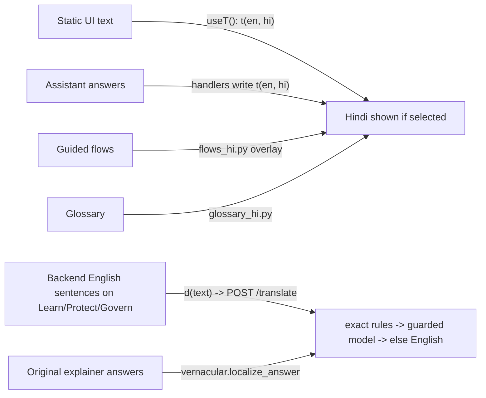

# Language: English and Hindi, chosen by the user

**Principle:** language is the user's choice, per screen (the **EN / हिन्दी** switch at the top). Selecting English keeps *everything* English; selecting Hindi makes everything Hindi. Nothing is forced either way.

## 1. The rule that makes Hindi trustworthy

> A translator may rephrase words but may **never** change a number.

In finance a fluent sentence with a wrong amount is the worst failure, because the reader cannot easily spot it. So Hindi comes from three sources, in order of preference:

| Source | Used for | Accuracy |
|---|---|---|
| **Hand-written Hindi templates** with figures inserted by code | assistant tool answers, guided flows, scam scenarios, glossary, digest | exact |
| **Exact rule tables** (`hindi_rules.py`, `hindi_page_rules.py`) matching the English sentences the backend emits | explainer sentences, scanner / tax / firewall / stress / drill-down text | exact |
| **Guarded model fallback** (`vernacular._one`) | any sentence no rule matches | rejected if it changes a number |

The guard (`vernacular.numbers_preserved`) compares every figure in the English with the Hindi, and also checks "94 out of 100" still reads 94 of 100 (an early model trial produced "94 में से 100"). A line that fails, or does not come back as Hindi (`looks_hindi`), is shown **in English** rather than as a wrong Hindi line.

## 2. What is translated, and how

| Surface | Mechanism |
|---|---|
| Buttons, labels, headings, placeholders | `useT()` in `frontend/src/lib/i18n.ts`: `t(en, hindi)` |
| Backend-written English sentences on pages | `d(text)`: looks up a cache, else batches to `POST /translate` and re-renders when Hindi arrives (company names are never transliterated) |
| Assistant tool answers | every handler builds both languages; `Answer.lang="hi"` makes `localize_answer` skip the translator |
| Original explainer answers (health, risk, stress...) | `vernacular.localize_answer` -> exact rules, model fallback; follow-up chips keep English questions with Hindi labels |
| Guided flows | `backend/flows_hi.py` overlays title / text / note / options by step index; a test checks every Hindi flow lines up with English and keeps every figure |
| Glossary | `backend/glossary_hi.py` (`GLOSSARY_HI`, `TERM_NAME_HI`); a test requires every English term to have Hindi |
| Scam-call rehearsal | `backend/practice_hi.py`: Hindi scripts, flags and a Hindi reply classifier |
| Tip-scanner labels, claim statuses | `FLAG_LABEL_HI`, `CLAIM_STATUS_HI` |
| Microphone errors | `hiError()` maps the common ones |
| Voice | Hindi Kokoro voices; numbers spoken as words (`1.5 लाख रुपये`) |
| Spoken input | Whisper multilingual + `to_english` |

## 3. Per-screen language (and why it matters)

An early design stored one server-wide language. Any screen that chose Hindi switched every screen, and an English screen never reset it, so people who selected English saw Hindi. Now:

- every request carries its own `lang` (HTTP body, WebSocket command, `/stt?lang=`);
- the server reads it through a `ContextVar` (`_lang()`), falling back to the last-set value only for announcements nobody asked for;
- each tab has a random `cid`; replies are tagged with it and other tabs ignore them; untagged announcements in the other language are dropped on arrival;
- on load every screen announces its language (English too).

A test forces the server into Hindi and checks an English request still answers in English.

## 4. Hindi rule tables

`hindi_rules.py` holds ~70 hand-written patterns for explainer sentences (87 of 88 real sentences covered, no number problems). `hindi_page_rules.py` adds:

- `STATIC`: fixed sentences (scanner tactics and reasons, verdicts, stress windows, drill-down explanations).
- `RULES`: templated sentences with captures, e.g. `IT exposure would rise to 52.1%, above the 35.0% sector cap.` -> Hindi with the same numbers.
- `exact_whole()`: matches a fixed multi-sentence text as a whole, rejecting any rule that only matched by letting a capture swallow a sentence boundary.

Tests assert every fixed sentence in the scanner, stress and drill-down code has an exact Hindi translation, and that every translated figure is preserved.

## 5. Adding another language (say Marathi)

1. **UI strings:** extend `useT` to a language code and add the third string at each `t(en, hi)` call (or move strings to a catalogue).
2. **Assistant:** add the language to each handler's `t()` helper, or generate from a catalogue.
3. **Rule tables:** copy `hindi_rules.py`/`hindi_page_rules.py` as `<lang>_rules.py`; reuse `numbers_preserved`.
4. **Flows, glossary, scam scenarios:** create `flows_<lang>.py`, `glossary_<lang>.py`, `practice_<lang>.py`.
5. **Voice:** check Kokoro/Piper have a voice for the language (Kokoro currently ships Hindi, not Marathi); STT: Whisper multilingual supports it.
6. **Classifier:** write a reply classifier for scam rehearsal that tolerates transcriber spellings.
7. **Tests:** copy the number-preservation and completeness tests.

## 6. Limits

- Typed Hinglish (Roman-script Hindi) is understood only by the optional local model stage; offline it asks for clarification.
- The tip scanner's rules match English words, so tips must be pasted in English.
- A backend sentence that matches no rule and fails the model guard stays in English.
- Standalone pages other than Learn, Protect, Govern, Practice and the Assistant (for example parts of Portfolio and Research) are not fully Hindi yet.
