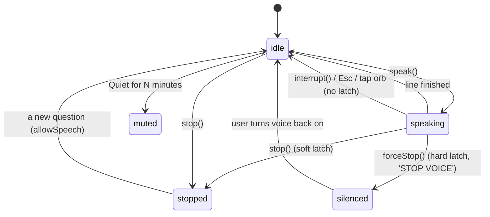

# Voice: speaking, listening, and stopping

Everything is local. No audio is sent to a cloud service.

## 1. Speaking (text to speech)

**Why server-side audio at all.** The browser's `speechSynthesis` could not be interrupted reliably, which was the product's top complaint ("it keeps talking and I cannot stop it"). Now the server renders each chunk to a **WAV**, and the browser plays it through **one `<audio>` element it controls**. Stopping is `audio.pause()` + clear the queue + abort in-flight fetches, measured at about 1 ms, mid-sentence.

| Engine | Role | Speed | Notes |
|---|---|---|---|
| **Kokoro** (ONNX, fp32) | primary | real-time factor ~0.44 on CPU | natural intonation; has English and Hindi voices |
| **Piper** | fallback | ~0.08 RTF | fast but flatter; used if Kokoro is missing |
| Browser `speechSynthesis` | last resort | | only if `/tts` returns 204 |

Kokoro int8 was ~1.9x slower than real time (unusable), so the fp32 model is used. onnxruntime runs on the **CPU provider** (the GPU is not used for TTS).

**Voices** (picker in the top bar, remembered per language): English - George, Daniel (British male), Michael (American male), Emma (British female), Heart (American female). Hindi - Psi, Omega (male), Alpha, Beta (female). Defaults: `kokoro:bm_george` and `kokoro:hm_psi`; override with `JARVIS_VOICE_EN` / `JARVIS_VOICE_HI`. Speed: English 1.12x, Hindi 1.04x (the model's default sounds slow).

**Making it sound like a person, not blocks**
- The **first sentence is synthesized alone** so audio starts quickly; the rest is joined into pieces of at most 45 words so intonation flows.
- No artificial pause between chunks; the next chunks are prefetched only after the current one arrives (concurrent requests made the long chunk win the server lock and delayed the start by ~4 s).
- Answers are **short by default** (`Answer.spoken()`); "tell me more" reads the long version (`spoken_full()`).
- A server cache (300 entries) makes repeats instant. `warm_up()` synthesizes a line per language at startup.
- Text is prepared for speech (`forSpeech`): `₹1.5 lakh` is spoken as words; in Hindi `x लाख रुपये`, `%` as प्रतिशत.

Measured first audio on this CPU: English ~2.3 s, Hindi ~0.9 s.

## 2. Stopping (the most important control)

| Control | Effect |
|---|---|
| `interrupt()` | cut the voice now; the next answer still plays (used when you start talking or tap the orb) |
| `stop()` | cut now **and stay quiet until you ask something new** (the Stop buttons) |
| `forceStop()` | everything off until you re-enable it (**STOP VOICE**) |
| Quiet for 1/5/15/60 min | timed silence with a live countdown, persisted across reloads |
| Voice + text / Text only | stops all automatic speech; explicit "Read aloud" still speaks |
| `Esc` | interrupt while speaking (without latching), cancel the mic when listening |

**Generation counter.** Every halt bumps `speechGeneration()`. A multi-part player (the weekly digest, the scam caller) records the generation after it speaks a line; when the line "ends" it checks whether the generation moved. If so it was **cut off, not finished**, so the whole briefing or call ends instead of moving to the next line. (An earlier bug let the digest continue after the Stop button because "interrupted" looked like "finished".)

**Cross-tab dedupe.** Two open tabs would both speak the same event; a shared claim in `localStorage` lets one tab speak.

## 3. Listening (speech to text)

- **Engine:** `faster-whisper`, local. English uses the `small.en` model by default (`JARVIS_STT_MODEL`); Hindi uses multilingual `small` with the task `transcribe` and no initial prompt.
- **Push-to-talk:** tap the orb (or the mic button, or hold `SPACE`). The browser records with `MediaRecorder`; a **timer-based voice-activity detector** ends the utterance on a pause. (It uses a timer, not `requestAnimationFrame`, which browsers throttle in background tabs.)
- **Vocabulary priming:** `initial_prompt` carries the product's words (tickers, "Mphasis", "NSE") and `snap_to_grammar` repairs near-misses ("by" -> "buy").
- **Safety floors:** a transcript under 0.45 confidence is shown but **not dispatched** if it parses as a command (a misheard "sell" is not recoverable); for plain questions the floor is 0.30.
- **Hindi speech:** transcribed as Hindi and understood by `hindi_input` (figures and intent read in code; no free translation) - see [LANGUAGE.md](LANGUAGE.md#2b-understanding-hindi-questions-voice-or-keyboard).
- **Raw mode:** `POST /stt?raw=true` returns just the transcript, with no translation and no dispatch. The scam-call rehearsal uses it so a Hindi reply is scored *as Hindi*.
- **Measured:** about 0.85-1.4 s per command on CPU int8.

## 4. Hands-free scam-call rehearsal

After each caller line finishes (the generation check above), the mic opens by itself, records until silence, transcribes in raw mode, shows "You said: ...", and scores it. A Stop anywhere closes the mic and turns hands-free off so it never reopens on its own. Tolerance for transcriber spelling (for example "ठगी" heard as "तगी") and for a code read out as number words is covered by tests.

## 5. Barge-in (optional)

Talking over the assistant to interrupt it is implemented but **off by default** (it needs echo cancellation and works best with headphones). Toggle: "talk over me to interrupt".

## 6. Environment variables

| Variable | Default | Meaning |
|---|---|---|
| `JARVIS_VOICE_EN` | `kokoro:bm_george` | default English voice |
| `JARVIS_VOICE_HI` | `kokoro:hm_psi` | default Hindi voice |
| `JARVIS_STT_MODEL` | `small.en` | Whisper model for English |

## 7. Known limits

- Voice *quality* and Hindi recognition on real human voices need a human to judge; tests use synthesized speech.
- Whisper's Hindi spelling is loose; the matching is tolerant, but unusual phrasings can still fail (the app then asks you to try again).
- No GPU acceleration for TTS yet (it would need onnxruntime-gpu + CUDA for roughly a one-second gain).
